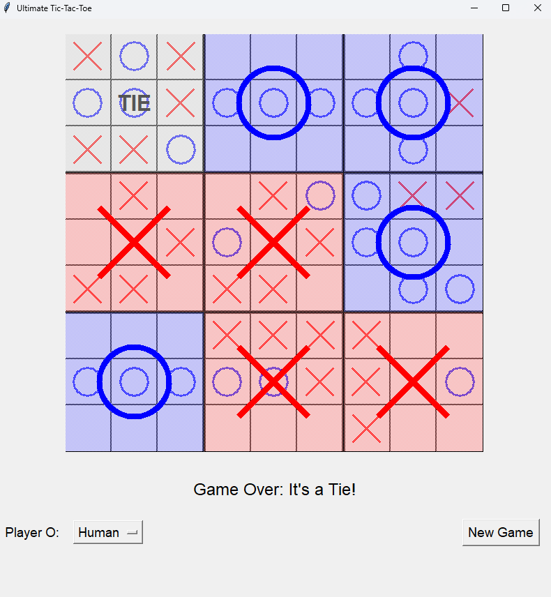
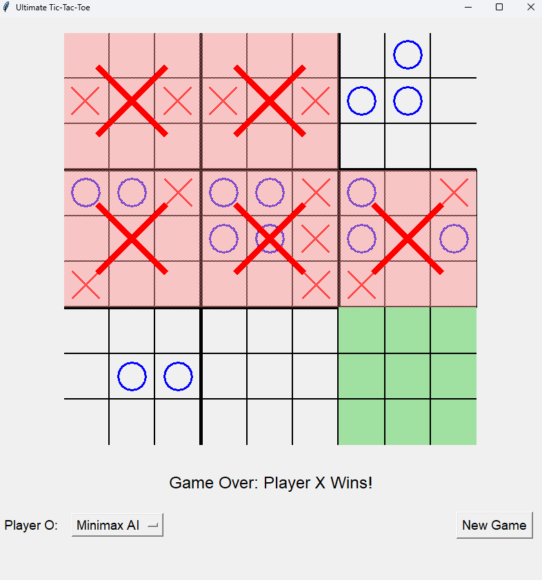

# Ultimate Tic-Tac-Toe with CSP & AI Solvers

An advanced Ultimate Tic-Tac-Toe game using CSP-based reasoning and AI search techniques like Backtracking, AC-3, Forward Checking, and Minimax with Alpha-Beta Pruning and optimization.


[](https://github.com/noumanic)

## 🎮 Game Overview

Ultimate Tic-Tac-Toe is a strategic variant of the classic game, played on a 3×3 grid of smaller 3×3 Tic-Tac-Toe boards. The objective is to win three small boards in a row (horizontally, vertically, or diagonally) on the larger board.

### Key Rules
- Players take turns marking spots ('X' or 'O') on small boards
- The position of your move determines which board your opponent plays on next
- If directed to a completed board, the opponent can play anywhere
- Win three small boards in a row to win the game

## 📸 Screenshots

### Human vs Human Mode


### Minimax AI Mode


### CSP-Minimax Hybrid AI Mode


## 🤖 AI Implementations

This project implements three distinct AI approaches:

### 1. **CSP Solver with Backtracking**
- **Forward Checking**: Eliminates illegal moves early in the search
- **Arc Consistency (AC-3)**: Ensures valid board states through constraint propagation
- **MRV Heuristic**: Minimum Remaining Values for optimal variable selection
- **Degree Heuristic**: Tie-breaking based on constraint involvement
- **Least Constraining Value**: Smart value ordering to maximize future options

### 2. **Minimax AI with Alpha-Beta Pruning**
- Classic game tree search algorithm
- Alpha-Beta pruning for efficient exploration
- Configurable search depth (default: 3 levels)
- Advanced board evaluation heuristics

### 3. **Hybrid CSP-Minimax AI** ⭐ (Recommended)
- Combines CSP constraint propagation with Minimax search
- Uses CSP to narrow the search space intelligently
- Applies Alpha-Beta pruning on CSP-filtered moves
- Strategic move ordering for optimal performance
- Best balance of speed and intelligence

## 🚀 Features

- **Interactive GUI**: Clean Tkinter-based interface with 800x850 resolution
- **Visual Feedback**: 
  - Highlighted active boards (green)
  - Color-coded won boards (Red for X, Blue for O, Gray for Tie)
  - Clear move indicators with X and O symbols
  - Bold grid separators for big boards
- **Flexible Gameplay**: Play against different AI opponents or human
- **Real-time Analysis**: Watch AI decision-making in action
- **Strategic Evaluation**: Advanced heuristics for position assessment
- **Responsive Design**: Smooth animations and instant feedback

## 📋 Requirements

```
Python 3.7+
tkinter (included with Python standard library)
```

## 🔧 Installation

1. Clone the repository:
```bash
git clone https://github.com/noumanic/TicTacToe-AI.git
cd TicTacToe-AI
```

2. (Optional) Install dependencies:
```bash
pip install -r requirements.txt
```

3. Run the game:
```bash
python tictactoe.py
```

## 🎯 Usage

1. Launch the application
2. Select your opponent (Player O) from the dropdown menu:
   - **Human**: Two-player mode
   - **Minimax AI**: Traditional game tree search
   - **CSP-Minimax Hybrid AI**: Advanced constraint-based AI (recommended)
3. Click on any valid position to make your move as Player X
4. The active board is highlighted in green
5. Click "New Game" to reset and start over

### Game Controls
- **Left Click**: Make a move on the board
- **Dropdown Menu**: Switch between AI opponents
- **New Game Button**: Reset the game

## 🧠 CSP Formulation

### Variables
- Each empty position on the 3×3 small boards represents a variable
- Variables: `(big_row, big_col, small_row, small_col)` where:
  - `big_row, big_col`: Position of small board in the large grid (0-2)
  - `small_row, small_col`: Position within the small board (0-2)

### Domains
- Available moves for the current player ('X' or 'O')
- Dynamically filtered based on:
  - Active board constraints
  - Already occupied positions
  - Won/completed board status

### Constraints
1. **Valid Move Constraint**: Moves must follow the active small board rule
2. **Occupancy Constraint**: Cannot mark already occupied positions
3. **Board Status Constraint**: No moves on completed small boards
4. **Win Condition Constraints**: Enforce winning patterns for small and large boards
5. **Sequential Constraint**: Players alternate turns (X → O → X → ...)
6. **Active Board Constraint**: Next move location depends on previous move position

## 📊 Algorithm Comparison

| Algorithm | Strengths | Speed | Optimality | Search Depth |
|-----------|-----------|-------|------------|--------------|
| CSP Solver | Constraint awareness, early pruning | ⚡ Fast | Good | N/A |
| Minimax | Complete search, proven optimal | 🐢 Slower | Optimal* | 3 levels |
| Hybrid CSP-Minimax | Best of both worlds | ⚡⚡ Fast | Near-optimal | 3 levels |

*Optimal within search depth limits

### Performance Characteristics
- **CSP Solver**: Best for constraint-heavy positions, O(b^d) with aggressive pruning
- **Minimax**: Thorough evaluation, suitable for endgame scenarios
- **Hybrid**: 30-50% faster than pure Minimax with comparable move quality

## 🎓 Academic Context

This implementation addresses the following computer science concepts:

### CSP Techniques
- **Backtracking Search**: Systematic exploration of solution space
- **Forward Checking**: Early domain reduction
- **Arc Consistency (AC-3)**: Constraint propagation
- **Variable Ordering Heuristics**: MRV and Degree heuristics
- **Value Ordering**: Least Constraining Value heuristic

### Game-Playing AI
- **Minimax Algorithm**: Optimal decision-making in adversarial games
- **Alpha-Beta Pruning**: Efficient tree search optimization
- **Evaluation Functions**: Strategic board assessment
- **Move Ordering**: Improving pruning efficiency

### Hybrid Approaches
- **Constraint-Guided Search**: Using CSP to focus Minimax
- **Multi-Strategy AI**: Combining complementary techniques
- **Adaptive Search Depth**: Dynamic branching factor control

## 📈 Performance Optimizations

- **AC-3 Preprocessing**: Reduces search space before Minimax
- **Move Ordering**: Strategic evaluation for better alpha-beta cuts
- **Branching Factor Reduction**: Limits moves at deeper levels (top 5)
- **Quick Evaluation**: Fast heuristics for preliminary move assessment
- **Domain-Specific Heuristics**: 
  - Center control (small & big boards)
  - Corner positioning strategy
  - Threat detection and blocking
  - Sending opponent to won/unfavorable boards

### Evaluation Function Components
```python
- Win detection: ±1000 points
- Small board wins: ±100 points
- Two-in-a-row threats: ±10 points
- Center board control: ±50 points
- Corner board control: ±20 points each
- Strategic positioning: 2-5 points
```

## 🛠️ Technical Implementation

### Key Classes
- **`UltimateTicTacToe`**: Core game logic and state management
- **`CSPSolver`**: Constraint satisfaction problem solver
- **`MinimaxAI`**: Traditional Minimax with alpha-beta pruning
- **`HybridCSPMinimaxAI`**: Combined CSP-Minimax approach
- **`UltimateTicTacToeGUI`**: Tkinter-based graphical interface

### Code Statistics
- ~1000 lines of Python code
- Modular architecture for easy extension
- Deep copy operations for state exploration
- Efficient data structures (nested lists, defaultdict)

## Contributing

Contributions are welcome! Feel free to:
- Report bugs
- Suggest new features
- Improve AI strategies
- Enhance the GUI
- Add performance benchmarks
- Improve documentation

### How to Contribute
1. Fork the repository
2. Create a feature branch (`git checkout -b feature/AmazingFeature`)
3. Commit your changes (`git commit -m 'Add some AmazingFeature'`)
4. Push to the branch (`git push origin feature/AmazingFeature`)
5. Open a Pull Request

## License

This project is licensed under the MIT License - see the [LICENSE](LICENSE) file for details.

## Author

**Muhammad Nouman Hafeez**
- GitHub: [@noumanic](https://github.com/noumanic)
- Email: noumanhafeez.nh11@gmail.com

Created as part of an AI/CSP course project exploring constraint satisfaction and game-playing algorithms.

## 🔮 Future Enhancements

See [TO-DO.txt](TO-DO.txt) for planned features and improvements.

Potential additions:
- [ ] Monte Carlo Tree Search (MCTS) implementation
- [ ] Neural network-based evaluation
- [ ] Opening book for common positions
- [ ] Performance statistics and analytics dashboard
- [ ] Game replay and move history
- [ ] Difficulty levels for AI
- [ ] Multiplayer online mode
- [ ] Save/load game functionality
- [ ] Tournament mode with ELO ratings
- [ ] Mobile app version (Kivy/React Native)
- [ ] Sound effects and animations

## 📚 References

- Russell, S., & Norvig, P. (2020). *Artificial Intelligence: A Modern Approach* (4th ed.)
- Mackworth, A. K. (1977). "Consistency in Networks of Relations"
- Knuth, D. E., & Moore, R. W. (1975). "An Analysis of Alpha-Beta Pruning"
- CSP Solving Techniques in Game Playing
- Ultimate Tic-Tac-Toe Strategy Analysis

## 🏆 Acknowledgments

- Python Tkinter for the GUI framework
- AI/CSP course materials and resources
- Ultimate Tic-Tac-Toe community for strategy insights

---

⭐ **Star this repository if you found it helpful!**

🐛 **Found a bug?** [Open an issue](https://github.com/noumanic/TicTacToe-AI/issues)

💡 **Have a suggestion?** [Submit a pull request](https://github.com/noumanic/TicTacToe-AI/pulls)

---

*Built with 🧠 and ☕ by Muhammad Nouman Hafeez*